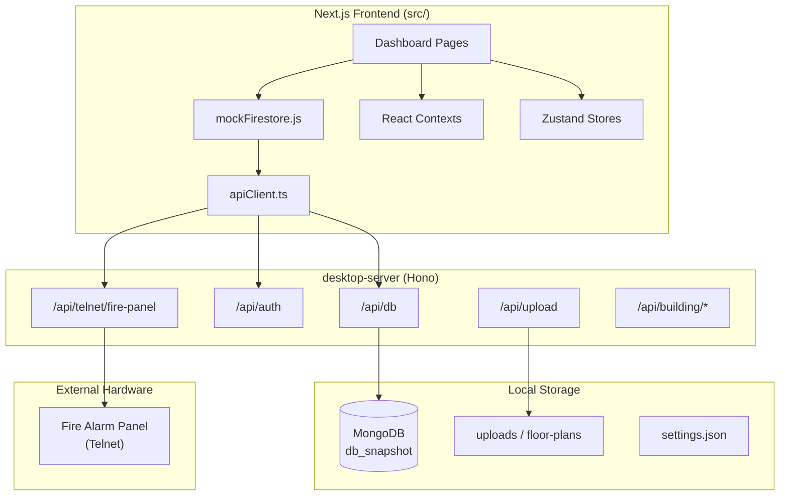

# Vision365 — Full Application Overview

This document describes the **Vision365 Minimal** application (`vision365-minimal`): what it does, how it is built, and how its major features fit together.

---

## Table of Contents

1. [What Is Vision365?](#what-is-vision365)
2. [Tech Stack](#tech-stack)
3. [Architecture](#architecture)
4. [User Roles & Authentication](#user-roles--authentication)
5. [Application Features](#application-features)
6. [Routes & Navigation](#routes--navigation)
7. [Backend API](#backend-api)
8. [State Management](#state-management)
9. [Data Model](#data-model)
10. [Desktop vs Web](#desktop-vs-web)
11. [Project Structure](#project-structure)
12. [Getting Started](#getting-started)
13. [Related Documentation](#related-documentation)

---

## What Is Vision365?

**Vision365** is a building and fire-alarm management platform designed for property managers, facility operators, and fire-safety teams. It helps organizations:

- Manage **communities** (property groups) and **buildings**
- Track and configure **fire-safety assets** (detectors, panels, devices)
- Create interactive **floor-plan graphics** with device placement
- Monitor **fire alarm panels** in real time via telnet
- View **live fire, trouble, and supervisory** alarm feeds
- Review **alarm message history**
- Operate fully **offline** as a desktop application (Tauri)

The app targets environments where fire panels (e.g. Simplex-style systems) are connected over a local network and building floor plans need to be visualized with live device status.

---

## Tech Stack

| Layer | Technology |
|-------|------------|
| **Frontend framework** | Next.js 16 (App Router) |
| **UI library** | React 19 |
| **Styling** | Tailwind CSS 3, Radix UI, shadcn-style components |
| **Forms & validation** | react-hook-form, Zod |
| **3D visualization** | Three.js, @react-three/fiber, @react-three/drei |
| **Client state** | React Context + Zustand 5 |
| **Local backend** | Hono (Node.js) in `desktop-server/` |
| **Database** | MongoDB (embedded in desktop; document snapshot model) |
| **Desktop shell** | Tauri v2 (Rust) |
| **File handling** | Local filesystem, xlsx, dxf-parser |
| **Auth** | bcryptjs sessions (server) + react-secure-storage (client) |
| **Theming** | next-themes (light/dark/system) |

> **Note:** The root `README.md` still mentions a JSON-only database. The current runtime uses **MongoDB** via the `desktop-server`, seeded from `data/db.json` on first run. Firebase is **not used** — imports are aliased to local mock modules.

---

## Architecture



### Request flow

1. Dashboard pages read/write data through `mockFirestore.js` (a Firestore-compatible API).
2. `apiClient.ts` routes requests to the local Hono server at `http://127.0.0.1:47821`.
3. In **web dev**, Next.js rewrites `/api/*` and `/local/*` to the Hono server (`next.config.mjs`).
4. In **desktop**, Tauri starts the Hono server and serves the static-exported Next.js UI in a WebView.
5. The Hono server persists data in MongoDB (`db_snapshot` collection) and files on disk.

### Provider tree (root layout)

The app wraps all pages in a layered provider stack (`src/app/layout.js`):

```
ThemeProvider
  └── DesktopProvider
        └── FirePanelProvider
              └── AssetFireStatusProvider
                    └── FireAlertProvider
                          └── LivePanelAlertProvider
                                └── AppProvider
                                      └── AssetTypeIconsProvider
                                            └── RoleGuard → {children}
```

---

## User Roles & Authentication

### Roles

| Role | Access |
|------|--------|
| **Admin** | Full access to all dashboard routes (communities, buildings, assets, graphics, network, alarms) |
| **Client** | Limited access: graphics view, alarm history, and live panel pages only |

Route permissions are defined in `src/config/role-routes.js` and enforced by `src/components/role-guard.jsx`.

### Default credentials

| Role | Email | Password |
|------|-------|----------|
| Admin | `admin@vision365.com` | `admin123` |
| Client | `client@vision365.com` | `Client123` |

### Login flow

1. User submits credentials on `/` (`src/components/login-form.jsx`).
2. The app queries `UserDB` via the mock Firestore layer.
3. On success, user session is stored in `react-secure-storage` via `AppContext.login()`.
4. `RoleGuard` checks the stored session and blocks unauthorized routes.
5. The desktop server also supports bcrypt-based sessions at `/api/auth/*` for server-side auth.

### Default home route

Both admin and client users land on:

**`/dashboard/floor_configuration/view`** (Graphics View)

---

## Application Features

### 1. Community Management

**Purpose:** Organize buildings into logical property groups (communities).

| Feature | Route | Description |
|---------|-------|-------------|
| Add Community | `/dashboard/community` | Create and manage community records |
| Assign Community | `/dashboard/community/assign` | Link buildings to communities |

**Key files:** `src/app/dashboard/community/`, `src/lib/communityBuildings.js`

---

### 2. Building Management

**Purpose:** Register buildings, assign them to users, and maintain building status/metadata.

| Feature | Route | Description |
|---------|-------|-------------|
| Add Buildings | `/dashboard/buildings` | Register new buildings with company registry, system brands, PPM categories |
| Assign Buildings | `/dashboard/buildings/assign_buildings` | Assign buildings to client users for scoped access |
| Edit Building | `/dashboard/buildings/edit_status` | List and edit building status |
| Building Detail | `/dashboard/buildings/edit_status/[buildingName]` | Edit a single building's full details |

**Key files:** `src/config/buildingFormConstants.js`, `src/components/buildings/`

---

### 3. Asset Management

**Purpose:** Import, create, map, and view fire-safety assets across buildings.

| Feature | Route | Description |
|---------|-------|-------------|
| Upload Assets | `/dashboard/assets` | Import assets from Simplex TXT files, Excel spreadsheets, and images |
| Create Assets | `/dashboard/assets/create` | Create assets from BOQ/BIM templates (SHIELD OMEGA X) |
| Map Assets | `/dashboard/assets/map_assets` | Transfer/map assets between buildings |
| View/Edit Assets | `/dashboard/assets/view` | Browse and edit building asset lists |
| Asset Details | `/dashboard/assets/view/details` | View and edit a single asset |

**Capabilities:**
- Custom asset type icons (`AssetTypeIconsContext`)
- Brand registry integration
- Live fire/trouble status overlay on floor maps
- Bulk import/export via CSV and Excel

**Key files:** `src/services/firestoreService.js`, `src/lib/floorMapAssets.js`

---

### 4. Floor Configuration & Graphics

**Purpose:** Build interactive floor-plan graphics with nested navigation and device placement.

This is a **three-step workflow**:

#### Step 1 — Building Setup
**Route:** `/dashboard/floor_configuration`

- Upload a building overview image
- Define floor names and structure

#### Step 2 — Edit Floors
**Route:** `/dashboard/floor_configuration/edit`

- Configure sections and subsections per floor
- Place assets/devices on floor plans
- Import/export placement data via CSV
- Support for DXF/CAD parsing (`dxf-parser`)

#### Step 3 — Graphics View
**Route:** `/dashboard/floor_configuration/view`

- Interactive nested navigation: **Building → Floor → Section → Subsection**
- Device icons with live status indicators
- Deep links from fire alerts to the correct floor location

**Key files:**
- `src/lib/nestedFloorPlan.js`
- `src/lib/floorPlanStorage.js`
- `src/components/floor-plan/`

---

### 5. Community Overview Dashboard

**Route:** `/dashboard/community-overview`

A high-level operational dashboard (not shown in the sidebar, but fully routable):

- Per-community building and floor overview
- Live alarm feeds (fire, trouble, supervisory)
- 3D building model viewer (`src/components/3d/ModelViewer.tsx`)
- Asset control modals
- Fullscreen presentation mode
- Floor markers with live status

---

### 6. Network & Fire Panel Monitoring

**Route:** `/dashboard/network`

**Purpose:** Connect to fire alarm panels over telnet and send commands.

| Capability | Description |
|------------|-------------|
| Telnet connection | Connect to panel (default `192.168.100.1:23`) |
| Panel commands | `cshow`, `login`, list fetches, acknowledge, silence, system reset |
| Auto-reconnect | Automatic reconnection on connection loss |
| State sync | Panel state persisted to MongoDB |
| Status badges | Connection and alarm count indicators in the UI |

**Key files:**
- `src/stores/firePanelStore.js`
- `src/lib/firePanelMonitor.js`
- `desktop-server/src/services/firePanelService.ts`
- `desktop-server/src/services/firePanelWorker.ts`

---

### 7. Live Alarm Monitoring

Real-time views of fire panel alarm lists:

| Page | Route | Description |
|------|-------|-------------|
| Live Fire | `/dashboard/live-fire` | Active fire alarms from the panel |
| Live Trouble | `/dashboard/live-trouble` | Active trouble conditions |
| Live Supervisory | `/dashboard/live-supervisory` | Active supervisory signals |

**Alert system:**
- **Fire alerts** — modal with siren sound, navigation to floor plan (`FireModalContext`)
- **Trouble/Supervisory alerts** — beep notifications with acknowledge flow (`LivePanelAlertContext`)
- Background watcher (`live-panel-alert-watcher.jsx`) monitors for new panel events

**Key files:** `src/components/live-panel-list-page.jsx`, `src/components/fire-alert-modal.jsx`

---

### 8. Alarm Message History

**Route:** `/dashboard/alarm-messages/history`

- Persisted history of alarm messages per building
- Tabbed view: Alarm / Fire / Trouble / Supervisory
- Filter and search historical events

---

### 9. Desktop / Offline Mode

When packaged as a Tauri desktop app:

| Feature | Description |
|---------|-------------|
| Embedded MongoDB | Bundled `mongod` binary, no external DB required |
| Local file storage | Uploads, floor plans, backups on disk |
| Native file picker | Tauri dialog for file selection |
| Backup & restore | ZIP-based full data backup |
| Data export | CSV, Excel, PDF, JSON export |
| Splash screen | Waits for API readiness before showing UI |
| Settings persistence | Theme, notifications via `settingsStore` |

**App data location:** `%APPDATA%/Vision365/` (Windows), platform-specific elsewhere.

**Key files:** `src-tauri/`, `src/components/desktop-provider.jsx`, `desktop-server/src/services/backupService.ts`

---

## Routes & Navigation

### Public routes

| Route | File | Purpose |
|-------|------|---------|
| `/` | `src/app/page.js` | Login page |
| `/unauthorized` | `src/app/unauthorized/page.js` | Access denied page |

### Dashboard routes (23 pages)

| Route | Purpose | Sidebar | Admin | Client |
|-------|---------|---------|-------|--------|
| `/dashboard` | Redirects to default home | — | ✓ | ✓ |
| `/dashboard/community` | Add/manage communities | Community | ✓ | ✗ |
| `/dashboard/community/assign` | Assign buildings to communities | Community | ✓ | ✗ |
| `/dashboard/buildings` | Add/manage buildings | Buildings | ✓ | ✗ |
| `/dashboard/buildings/assign_buildings` | Assign buildings to users | Buildings | ✓ | ✗ |
| `/dashboard/buildings/edit_status` | Building list & status | Buildings | ✓ | ✗ |
| `/dashboard/buildings/edit_status/[buildingName]` | Single building editor | — | ✓ | ✗ |
| `/dashboard/community-overview` | Community dashboard | — | ✓ | ✗ |
| `/dashboard/floor_configuration` | Building setup (step 1) | Graphics | ✓ | ✗ |
| `/dashboard/floor_configuration/view` | Graphics view (step 3) | Graphics | ✓ | ✓ |
| `/dashboard/floor_configuration/edit` | Edit floors (step 2) | Graphics | ✓ | ✗ |
| `/dashboard/assets` | Upload assets | Assets | ✓ | ✗ |
| `/dashboard/assets/create` | Create assets | Assets | ✓ | ✗ |
| `/dashboard/assets/map_assets` | Map assets between buildings | — | ✓ | ✗ |
| `/dashboard/assets/view` | View/edit assets | Assets | ✓ | ✗ |
| `/dashboard/assets/view/details` | Asset detail page | — | ✓ | ✗ |
| `/dashboard/network` | Telnet fire panel client | Network | ✓ | ✗ |
| `/dashboard/alarm-messages/history` | Alarm history | Alarm Messages | ✓ | ✓ |
| `/dashboard/live-fire` | Live fire alarms | Alarm Messages | ✓ | ✓ |
| `/dashboard/live-trouble` | Live trouble alarms | Alarm Messages | ✓ | ✓ |
| `/dashboard/live-supervisory` | Live supervisory alarms | Alarm Messages | ✓ | ✓ |

### Configured but not implemented

| Route | Notes |
|-------|-------|
| `/dashboard/faq` | Listed in `role-routes.js`; FAQ registry is a stub |
| `/dashboard/finance` | Referenced in config; no page exists |

### Sidebar navigation

Defined in `src/components/app-sidebar.jsx`:

1. **Community** — Add Community, Assign Community
2. **Buildings** — Add Buildings, Assign Buildings, Edit Building
3. **Assets** — Upload Assets, Create Assets, View/Edit Assets
4. **Graphics** — Building Setup, Graphics View, Edit Floors
5. **Network** — Telnet Client
6. **Alarm Messages** — History, Live Fire, Live Trouble, Live Supervisory

Client users see only the sections/routes they are allowed to access; disabled items are hidden or greyed out.

---

## Backend API

There are **no Next.js API routes** (`src/app/api/` does not exist). All backend logic lives in `desktop-server/` and is proxied in development.

**Base URL:** `http://127.0.0.1:47821` (configurable via `VISION365_PORT`)

### Health

| Method | Path | Purpose |
|--------|------|---------|
| GET | `/health` | Server health, app data path, MongoDB URI |

### Database (Firestore-compatible)

| Method | Path | Purpose |
|--------|------|---------|
| POST | `/api/db` | Document operations: `get`, `list`, `set`, `update`, `delete`, `add`, `batch` |

### File uploads

| Method | Path | Purpose |
|--------|------|---------|
| POST | `/api/upload` | Upload file (multipart) |
| DELETE | `/api/upload` | Delete uploaded file |
| GET | `/local/*` | Serve local files from app data |

### Buildings & communities

| Method | Path | Purpose |
|--------|------|---------|
| POST | `/api/building/all` | List all buildings |
| GET | `/api/admin/get-mails` | List users |
| GET | `/api/buildings/unassigned` | Unassigned buildings |
| POST | `/api/buildings/with-community-status` | Buildings with community status |
| GET | `/api/community/:id/buildings` | Buildings in a community |
| POST | `/api/community/:id/assign-buildings` | Assign buildings |
| POST | `/api/community/:id/remove-buildings` | Remove buildings |

### Authentication

| Method | Path | Purpose |
|--------|------|---------|
| POST | `/api/auth/login` | Login → session token |
| POST | `/api/auth/logout` | Invalidate session |
| GET | `/api/auth/session` | Validate Bearer token |
| POST | `/api/auth/change-password` | Change password |

### Fire panel (telnet)

| Method | Path | Purpose |
|--------|------|---------|
| POST | `/api/telnet/fire-panel/connect` | Connect to panel |
| POST | `/api/telnet/fire-panel/disconnect` | Disconnect |
| GET | `/api/telnet/fire-panel/status` | Connection status |
| GET | `/api/telnet/fire-panel/alarm-totals` | Stored alarm totals |
| GET | `/api/telnet/fire-panel/panel-state` | Panel state counts |
| POST | `/api/telnet/fire-panel/panel-state` | Save panel state |
| POST | `/api/telnet/fire-panel/command` | Send telnet command |

### Backup, export & settings

| Method | Path | Purpose |
|--------|------|---------|
| POST | `/api/backup/create` | Create ZIP backup |
| GET | `/api/backup/list` | List backups |
| POST | `/api/backup/restore` | Restore from backup |
| POST | `/api/export/collection` | Export collection (CSV/Excel/PDF/JSON) |
| POST | `/api/export/full` | Full database export |
| GET | `/api/settings` | Load settings |
| POST | `/api/settings` | Save settings |

---

## State Management

### React Context (`src/contexts/`)

| Context | Purpose |
|---------|---------|
| **AppContext** | Main app state: user, communities, buildings, fire panel monitor, login/logout |
| **FireModalContext** | Fire alarm modal, siren audio, navigation to floor plan |
| **LivePanelAlertContext** | Trouble/supervisory alert modals and beep sounds |
| **AssetTypeIconsContext** | Custom asset type icon mappings |

### Zustand stores (`src/stores/`)

| Store | Purpose |
|-------|---------|
| `firePanelStore` | Telnet connection, host/port, auto-reconnect, command queue |
| `assetFireStatusStore` | Live asset fire status from panel |
| `deviceEnabledStore` | Device enable/disable state |
| `settingsStore` | Desktop settings (theme, notifications) — persisted |

### Key hooks (`src/hooks/`)

| Hook | Purpose |
|------|---------|
| `useAppData` | Communities, buildings, user — preferred for dashboard pages |
| `usePageAuth` | Auth guard with optional role redirect |
| `useFirePanelMonitor` | Fire panel fields from AppContext |
| `useFloorMapAssetStatusLive` | Live status overlay on floor maps |
| `useResolvedAssetUrl` | Resolve local/upload asset URLs |
| `useDesktopFilePicker` | Tauri native file picker |

---

## Data Model

Data is stored as a **single JSON document snapshot** in MongoDB (`db_snapshot` collection), seeded from `data/db.json`.

### Top-level collections (document keys)

| Key | Description |
|-----|-------------|
| `UserDB` | User accounts (email, password, role, assigned buildings) |
| `communities` | Community records |
| `AssetsList` | Assets per building |
| `BrandRegistry` | System brand mappings |
| `Staffs` | Staff list |
| `jobs` | Job tracking |
| Per-building keys | Floor map data, alarm feeds (via FirestoreService) |

### File storage

| Location | Contents |
|----------|----------|
| `public/uploads/` (dev) | Floor plan images, asset documents |
| App data `uploads/` (desktop) | Same, persisted locally |
| App data `floor-plans/` | Processed floor plan assets |
| App data `backups/` | ZIP backup archives |

---

## Desktop vs Web

| Aspect | Web (development) | Desktop (Tauri) |
|--------|-------------------|-----------------|
| **Frontend** | Next.js dev server (`npm run dev`) | Static export bundled in Tauri |
| **Backend** | Hono server must run separately | Hono started by Tauri |
| **Database** | MongoDB (local or embedded) | Embedded MongoDB bundled |
| **File storage** | `public/uploads/` | App data directory |
| **API proxy** | Next.js rewrites to Hono | Direct connection to Hono |
| **Native features** | None | File picker, notifications, window state |

### Recommended dev commands

```bash
# Web only (needs desktop-server for data)
npm run dev

# Web + API together (recommended)
npm run desktop:dev

# API server only
npm run desktop:server

# Full desktop production build
npm run desktop:build
```

---

## Project Structure

```
vision365-local/
├── data/
│   └── db.json                    # Seed/default data (migrated to MongoDB on first run)
├── desktop-server/                # Local Hono API backend
│   └── src/
│       ├── index.ts               # Server entry point
│       ├── db/                    # MongoDB, document store, seed, migrations
│       ├── routes/                # API route handlers
│       └── services/              # Auth, fire panel, backup, export, storage
├── docs/                          # Architecture and build documentation
│   ├── APP_OVERVIEW.md            # This file
│   ├── DESKTOP_ARCHITECTURE.md
│   ├── DESKTOP_BUILD.md
│   └── MIGRATION_PLAN.md
├── public/                        # Static assets, dev uploads
├── scripts/                       # Desktop build scripts
├── src/
│   ├── app/                       # Next.js App Router pages
│   │   ├── dashboard/             # All dashboard feature pages
│   │   ├── layout.js              # Root layout with providers
│   │   └── page.js                # Login page
│   ├── components/                # UI components
│   │   ├── ui/                    # shadcn-style primitives
│   │   ├── floor-plan/            # Floor plan editor and viewer
│   │   ├── 3d/                    # Three.js model viewer
│   │   └── ...                    # Layout, fire panel, alarms, etc.
│   ├── config/                    # Routes, API endpoints, constants
│   ├── contexts/                  # React Context providers
│   ├── hooks/                     # Custom React hooks
│   ├── lib/                       # Core logic (mock Firestore, fire panel, floor plans)
│   ├── services/                  # firestoreService.js — high-level data layer
│   ├── stores/                    # Zustand stores
│   └── utils/                     # Community and brand registry helpers
├── src-tauri/                     # Tauri v2 Rust desktop shell
├── next.config.mjs                # Next.js config (rewrites, Firebase aliases, desktop export)
├── package.json
├── tailwind.config.js
└── tsconfig.json
```

---

## Getting Started

### Prerequisites

- Node.js 18+
- For desktop builds: [Rust](https://rustup.rs), Tauri CLI v2

### Install and run (web)

```bash
npm install
npm run desktop:dev    # Starts Next.js + Hono API together
```

Open [http://localhost:3000](http://localhost:3000) and log in with admin credentials.

### Install and run (desktop dev)

```bash
npm install
cd src-tauri && cargo tauri dev
```

### Environment variables

| Variable | Default | Purpose |
|----------|---------|---------|
| `VISION365_PORT` | `47821` | Hono API port |
| `VISION365_APP_DATA` | Platform app data dir | Override data directory |
| `VISION365_SEED_PATH` | Built-in defaults | Custom seed JSON path |
| `VISION365_MONGO_URI` | Embedded/local | External MongoDB URI |
| `VISION365_MONGO_PORT` | (embedded default) | MongoDB port |
| `VISION365_MONGOD_PATH` | Bundled path | Path to mongod binary |
| `DESKTOP_BUILD` | — | Set to `1` for static export build |

---

## Related Documentation

| Document | Path | Description |
|----------|------|-------------|
| README | `README.md` | Quick start (partially outdated) |
| Desktop Architecture | `docs/DESKTOP_ARCHITECTURE.md` | Detailed desktop architecture |
| Desktop Build | `docs/DESKTOP_BUILD.md` | Tauri build prerequisites and commands |
| Migration Plan | `docs/MIGRATION_PLAN.md` | Phased web → desktop migration |
| Code Changes | `docs/CODE_CHANGES.md` | Change log |
| Agent Rules | `AGENTS.md` | Next.js 16 breaking changes notice |

---

## Key File Index

| Area | Primary files |
|------|---------------|
| Entry & layout | `src/app/layout.js`, `src/app/page.js` |
| Navigation | `src/components/app-sidebar.jsx`, `src/config/role-routes.js` |
| Auth | `src/components/login-form.jsx`, `src/components/role-guard.jsx` |
| Data layer | `src/lib/mockFirestore.js`, `src/services/firestoreService.js` |
| API client | `src/lib/apiClient.ts`, `next.config.mjs` |
| Fire panel | `src/lib/firePanelMonitor.js`, `src/stores/firePanelStore.js` |
| Floor plans | `src/lib/nestedFloorPlan.js`, `src/app/dashboard/floor_configuration/*` |
| Backend server | `desktop-server/src/index.ts`, `desktop-server/src/db/documentStore.ts` |
| Seed data | `data/db.json`, `desktop-server/src/db/seed.ts` |
| Desktop shell | `src-tauri/`, `src/components/desktop-provider.jsx` |

---

*Generated from full project analysis. Last updated: July 2026.*
