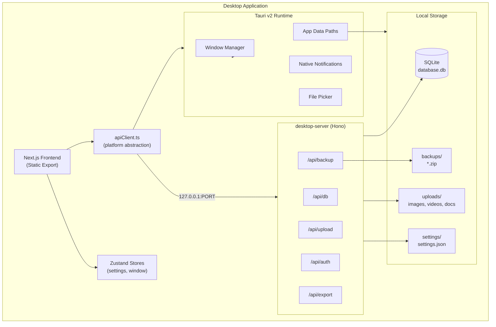

# Vision365 Desktop Architecture

Offline-first desktop application built with **Next.js** (frontend) + **Tauri v2** (runtime) + **SQLite/Drizzle** (data) + **local filesystem** (uploads).

---

## 1. Folder Structure

```
vision365-minimal/
├── docs/
│   ├── DESKTOP_ARCHITECTURE.md      # This document
│   └── MIGRATION_PLAN.md            # Phased migration guide
├── src-tauri/                       # Tauri Rust runtime
│   ├── src/
│   │   ├── main.rs                  # Entry point, spawns local API
│   │   ├── lib.rs                   # Tauri builder + command registration
│   │   ├── commands/                # Native desktop commands
│   │   │   ├── mod.rs
│   │   │   ├── paths.rs             # App data directory resolution
│   │   │   ├── window.rs            # Window state persistence
│   │   │   ├── notifications.rs     # Native notifications
│   │   │   └── files.rs             # Native file picker
│   │   ├── paths.rs
│   │   └── state.rs
│   ├── capabilities/
│   ├── icons/
│   ├── Cargo.toml
│   └── tauri.conf.json
├── desktop-server/                  # Local TypeScript API (offline backend)
│   ├── src/
│   │   ├── index.ts                 # Hono HTTP server entry
│   │   ├── db/
│   │   │   ├── schema.ts            # Drizzle SQLite schema
│   │   │   ├── client.ts            # Database connection
│   │   │   ├── migrate.ts           # Migration runner
│   │   │   ├── seed.ts              # Default data seeding
│   │   │   └── documentStore.ts     # Firestore-compatible document ops
│   │   ├── routes/
│   │   │   ├── db.ts                # /api/db (replaces Next.js route)
│   │   │   ├── upload.ts            # /api/upload
│   │   │   ├── buildings.ts         # Building/community REST routes
│   │   │   ├── auth.ts              # Local authentication
│   │   │   ├── backup.ts            # Backup/restore
│   │   │   └── export.ts            # CSV/Excel/PDF/JSON export
│   │   └── services/
│   │       ├── authService.ts       # bcrypt, sessions, PIN lock
│   │       ├── storageService.ts    # App data paths, directory init
│   │       ├── uploadService.ts     # File validation, thumbnails
│   │       ├── backupService.ts     # ZIP backup/restore
│   │       ├── exportService.ts     # Data export
│   │       └── settingsService.ts   # settings.json management
│   ├── drizzle/
│   │   └── 0000_initial.sql         # Initial migration
│   └── drizzle.config.ts
├── src/
│   ├── lib/
│   │   ├── platform.ts              # Web vs desktop detection
│   │   ├── apiClient.ts             # Unified fetch/invoke layer
│   │   ├── desktop/
│   │   │   └── stores/              # Zustand stores (settings, window)
│   │   ├── mockFirestore.js         # Updated: routes through apiClient
│   │   └── mockStorage.js           # Updated: routes through apiClient
│   └── stores/                      # Zustand (desktop settings)
│       └── settingsStore.ts
├── data/
│   └── db.json                      # Web dev seed (migrated to SQLite on desktop)
└── public/                          # Static assets (bundled in desktop build)
```

---

## 2. Architecture Diagram



### Data Flow (Desktop)

1. Tauri starts → resolves `%APPDATA%/Vision365/` (or macOS/Linux equivalents)
2. Tauri spawns `desktop-server` on `127.0.0.1:{port}`
3. Migrations run → SQLite created if missing → seed from `db.json` if empty
4. Next.js static UI loads in WebView
5. `apiClient` routes all `/api/*` calls to local Hono server
6. Uploads saved to `{AppData}/uploads/{category}/`
7. Settings persisted to `{AppData}/settings/settings.json`

---

## 3. SQLite Schema (Drizzle)

### Core Tables

| Table | Purpose |
|-------|---------|
| `db_snapshot` | Full JSON document store (Firestore-compatible, Phase 1) |
| `users` | Local user accounts with bcrypt password hashes |
| `sessions` | Active login sessions |
| `files` | Uploaded file metadata index |
| `settings` | Key-value application settings |
| `schema_migrations` | Migration version tracking |

### `db_snapshot` (Phase 1 — zero functionality loss)

Stores the entire `db.json` structure as a single JSON blob. All existing `serverDb.js` operations work unchanged via read-modify-write with SQLite transactions.

```sql
CREATE TABLE db_snapshot (
  id INTEGER PRIMARY KEY CHECK (id = 1),
  data TEXT NOT NULL,           -- JSON string of full database
  updated_at TEXT NOT NULL
);
```

### `users` (Local Auth)

```sql
CREATE TABLE users (
  id TEXT PRIMARY KEY,
  email TEXT UNIQUE NOT NULL,
  password_hash TEXT NOT NULL,
  role TEXT NOT NULL DEFAULT 'admin',
  designation TEXT,
  pin_hash TEXT,
  remember_login INTEGER DEFAULT 0,
  created_at TEXT NOT NULL,
  updated_at TEXT NOT NULL
);
```

### `files` (Upload Index)

```sql
CREATE TABLE files (
  id TEXT PRIMARY KEY,
  category TEXT NOT NULL,       -- images, videos, documents, audio, temp
  original_name TEXT NOT NULL,
  stored_name TEXT NOT NULL,
  relative_path TEXT NOT NULL,
  mime_type TEXT,
  size_bytes INTEGER NOT NULL,
  checksum TEXT,
  created_at TEXT NOT NULL
);
CREATE INDEX idx_files_category ON files(category);
```

### `settings`

```sql
CREATE TABLE settings (
  key TEXT PRIMARY KEY,
  value TEXT NOT NULL,          -- JSON
  updated_at TEXT NOT NULL
);
```

### Phase 2 (Future Normalization)

Normalize `db_snapshot` into `documents(collection_path, document_id, data)` for query performance and indexing. Migration script provided in `desktop-server/src/db/normalize.ts`.

---

## 4. App Data Directory Layout

```
{AppData}/Vision365/
├── database/
│   └── database.db
├── uploads/
│   ├── images/
│   ├── videos/
│   ├── documents/
│   ├── audio/
│   └── temp/
├── floor-plans/              # Migrated from public/floor-plans
├── backups/
│   └── backup_2026-06-09T12-00-00.zip
├── exports/
├── settings/
│   └── settings.json
└── logs/
```

| Platform | Path |
|----------|------|
| Windows | `%APPDATA%/Vision365/` |
| macOS | `~/Library/Application Support/Vision365/` |
| Linux | `~/.config/Vision365/` |

---

## 5. Services Overview

### storageService.ts
- Resolves platform-specific app data paths
- Auto-creates directory structure on first launch
- Path traversal protection (sanitizes all paths)

### uploadService.ts
- Native file picker integration (via Tauri)
- Drag-and-drop (frontend, saved via API)
- File validation (type, size limits)
- Unique filename generation
- Category routing (images/videos/documents/audio)
- Safe deletion with metadata cleanup

### authService.ts
- bcrypt password hashing (cost factor 12)
- PIN lock support
- Session tokens (crypto-random, stored in SQLite)
- Remember login / auto-login
- Migrates plaintext passwords from `db.json` on first run

### backupService.ts
- Manual backup → ZIP of database + uploads + settings
- Scheduled backup (configurable interval in settings)
- Encrypted ZIP option (AES-256 via password)
- Restore with integrity validation
- Never overwrites without confirmation

### exportService.ts
- CSV, Excel (xlsx), PDF, JSON export
- Single record, bulk, full database export
- Uses existing `xlsx` dependency

### settingsService.ts
- Theme, language, notification prefs
- Window size/position persistence
- Recently opened items
- Stored in `settings/settings.json` + SQLite `settings` table

---

## 6. Platform Abstraction

`src/lib/platform.ts` detects runtime:

```typescript
export const isDesktop = () => typeof window !== 'undefined' && '__TAURI__' in window;
export const isWeb = () => !isDesktop();
```

`src/lib/apiClient.ts` routes requests:

| Runtime | `/api/db` target |
|---------|------------------|
| Web (dev) | Next.js API route → `data/db.json` |
| Desktop | Hono server → SQLite |

No changes required in `FirestoreService`, dashboard pages, or UI components.

---

## 7. Security

| Threat | Mitigation |
|--------|------------|
| SQL injection | Drizzle parameterized queries |
| Path traversal | `path.normalize` + prefix validation in storageService |
| Password exposure | bcrypt hashing, never store plaintext after migration |
| Session hijacking | HttpOnly-equivalent: sessions only on localhost |
| File access | Sandboxed to app data directory |
| Settings tampering | Optional encryption for sensitive settings |

---

## 8. Auto-Update Architecture

Prepared for Tauri updater plugin:

- Database and uploads live **outside** the application bundle
- Migrations run on every app start (idempotent)
- `schema_migrations` table tracks applied versions
- Updater never touches `{AppData}/` — only replaces app binary

---

## 9. Performance Targets

| Metric | Strategy |
|--------|----------|
| Startup < 3s | Static export, lazy-load 3D viewer, defer non-critical seed |
| Memory < 200MB | SQLite WAL mode, no full-db polling, indexed file table |
| Fast search | SQLite FTS5 (Phase 2), local filtering in memory for Phase 1 |

---

## 10. Build & Distribution

See [MIGRATION_PLAN.md](./MIGRATION_PLAN.md) for step-by-step instructions.

### Quick Reference

```bash
# Development
npm run desktop:dev

# Production build (all platforms)
npm run desktop:build

# Platform-specific
npm run desktop:build:windows
npm run desktop:build:macos
npm run desktop:build:linux
```

### Installers

| Platform | Output | Tool |
|----------|--------|------|
| Windows | `.msi` / `.exe` | Tauri NSIS/WiX |
| macOS | `.dmg` / `.app` | Tauri DMG |
| Linux | `.deb` / `.AppImage` | Tauri bundler |
