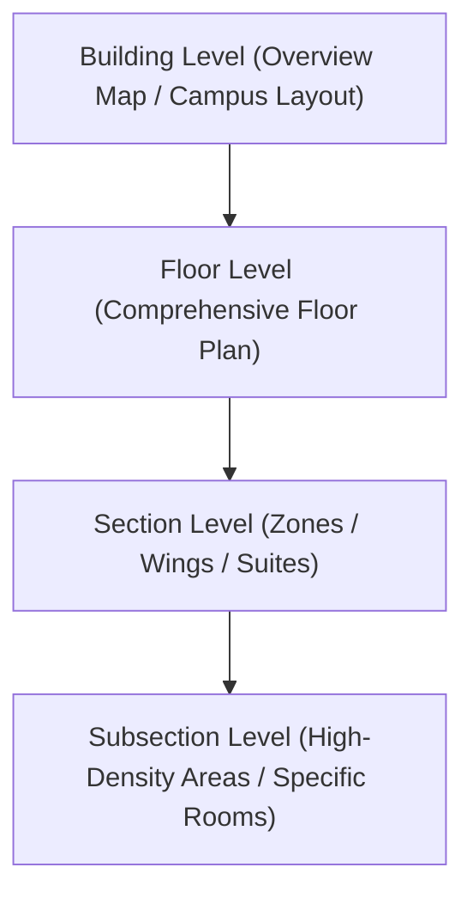
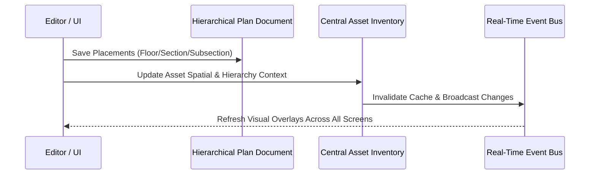

# Nested Floor Plans, Assets, and Placement Logic

## Overview

The spatial visualization and device management system provides multi-level hierarchical navigation and precision device tracking across complex facilities and campuses. The system translates physical architectural layouts into an intuitive nested structure, linking real-time hardware telemetry (such as fire, trouble, and supervisory alerts) directly to exact visual coordinates on floor maps.

---

## 1. Hierarchy & Navigation Logic

### Multi-Level Nested Structure
The spatial hierarchy is organized into a four-tiered tree structure:

1. **Building Level**:
   - Represents the top-level structure or campus overview.
   - Contains navigation markers or interactive floor selector rows to drill down into specific floors.
   - Automatically computes vertical and relative distributions for floor selection triggers.

2. **Floor Level**:
   - Displays the comprehensive plan layout of a selected floor.
   - Contains navigation markers corresponding to distinct architectural zones or wings (Sections).
   - Supports placing floor-wide assets or navigating deeper into sections.

3. **Section Level**:
   - Focuses on a specific wing, department, or fire zone within a floor.
   - Supports direct asset placement as well as further subdivision into Subsections.
   - Contains navigation markers for nested subsections where higher resolution is required.

4. **Subsection Level**:
   - The deepest level of granularity for high-density areas (such as electrical closets, server rooms, and mechanical suites).
   - Hosts pinpoint asset placements and micro-level device markers.

### Breadcrumb Navigation & Traversal
- Traversal maintains active context across all four levels: `Building > Floor > Section > Subsection`.
- At any level, breadcrumbs allow instant one-click navigation back to parent containers.
- When traversing backward, unsaved modifications (such as pending marker movements or newly placed assets) prompt confirmation to prevent data loss.

### Navigation Markers (Pins & Triggers)
- Navigation markers link a parent map to its child plan.
- Markers can be created manually by setting coordinates or imported automatically from CAD/drawing layers.
- Each navigation marker stores:
  - Destination identifier and target hierarchy level.
  - Display label and short identifier.
  - Normalized relative coordinates `(relativeX, relativeY)` within the parent image.

---

## 2. Coordinate System & Spatial Transformation Logic

### Dual-Coordinate Model
To ensure responsive layouts across different screens, window sizes, and resolutions without losing CAD millimeter accuracy, the system uses a dual-coordinate representation:

1. **Natural Pixel Coordinates `(x, y)`**:
   - Integer coordinates relative to the original full-resolution source image dimensions.
2. **Normalized Relative Coordinates `(relativeX, relativeY)`**:
   - Floating-point values clamped between `0.0` and `1.0`, representing percentage offsets from the top-left origin.

$$\text{relativeX} = \frac{x}{\text{Natural Width}}, \quad \text{relativeY} = \frac{y}{\text{Natural Height}}$$

### Image Rendering & Letterbox Compensation
When rendering floor plans inside dynamic containers:
- **Aspect Ratio Containment**: Floor plans preserve their aspect ratio using letterboxing (`contain` mode).
- **Offset & Dimension Calculations**: The rendering engine computes the rendered width, rendered height, horizontal offset (`offsetX`), and vertical offset (`offsetY`) inside the container.
- **Screen-to-Image Coordinate Translation**: User pointer events (clicks, taps, drops) calculate the bounding client rectangle, subtract letterbox offsets, and compute normalized coordinates:

$$\text{clickX} = \text{clientX} - \text{rect.left} - \text{offsetX}$$
$$\text{clickY} = \text{clientY} - \text{rect.top} - \text{offsetY}$$

### CAD / DXF Inversion & Bounding Box Remapping
- **Y-Axis Inversion**: CAD drawings and DXF coordinate systems place $(0,0)$ at the bottom-left with $Y$ increasing upward. Browser rendering places $(0,0)$ at the top-left with $Y$ increasing downward. The transformation engine automatically flips the $Y$ coordinate:
  $$\text{relativeY} = 1.0 - \text{relativeY}_{\text{CAD}}$$
- **Bounding Box Normalization**: When importing coordinates from CAD layers that exceed the pixel boundary or use arbitrary vector units, the system computes the global bounding box $(\min X, \min Y, \max X, \max Y)$ and normalizes coordinates across the span.

### Dynamic Marker Scaling
- Markers dynamically adjust their screen scale relative to the ratio of displayed width to natural image width.
- Marker scaling uses clamped thresholds to ensure pins remain crisp, readable, and non-overlapping on high-DPI displays, tablets, and ultra-wide monitoring consoles.

---

## 3. Asset Data Model & Device Classification

### Asset Properties
Every physical device tracked on a floor plan maintains a structured metadata payload:

- **Identification**: Asset ID, unique hardware barcode, serial number, and custom label.
- **Hardware Telemetry Address**: Panel number, card number, loop/channel, and device point address (e.g., `1-2-120`).
- **Classification**: Device category (Smoke Detector, Heat Sensor, Manual Pull Station, Sprinkler Valve, Strobe, Horn, Camera, etc.).
- **Hierarchical Placement Context**:
  - Building identifier and building name.
  - Floor identifier, name, and floor plan reference.
  - Section identifier and name (if applicable).
  - Subsection identifier and name (if applicable).
  - Hierarchical breadcrumb string (e.g., `Main Tower > Level 3 > West Wing > Electrical Room A`).
- **Spatial Position**: `x`, `y`, `relativeX`, `relativeY`, and 3D coordinate vector if configured.
- **Icon Configuration**: Asset-type icon key, custom SVG symbol, scale factor, and color overrides.

### Real-Time Status Aggregation
Assets dynamically reflect operational states received from hardware panels:
- **Normal / Healthy**: Standard display color and theme badge.
- **Fire Alarm**: Pulsing high-priority alarm visual, audible alerting, and automatic zoom/pan focus.
- **Trouble / Fault**: Diagnostic amber indicator with detailed fault descriptions (e.g., open loop, low battery, sensor dirty).
- **Supervisory**: Alert indicator for monitored utility systems (e.g., tamper switch, flow valve closed).
- **Acknowledge & Silence**: Visual status transitions reflecting operator acknowledgments.

---

## 4. Asset Placement Logic

The system provides three complementary methods for placing devices onto floor plans:

### Method A: Point-and-Click Placement
1. The user selects an unplaced asset from the asset drawer or search panel.
2. The canvas enters **Placement Mode**, displaying a crosshair cursor and ghost marker preview.
3. The user clicks the target location on the floor plan canvas.
4. The system:
   - Validates that the click falls within the valid plan image bounds.
   - Calculates exact natural and relative coordinates.
   - Associates the active hierarchy context (Building, Floor, Section, Subsection).
   - Generates an active mapping record and marks the asset as placed.

### Method B: Drag-and-Drop Placement
1. An operator drags an asset item card directly from the unplaced assets list.
2. The drag payload packages the asset identifier, address, and device type.
3. As the pointer hovers over the canvas, drop target coordinates are continuously computed with boundary clamping.
4. Upon drop, the coordinates are finalized, and the asset is instantly rendered at the drop position.

### Method C: Automated Batch Import (CSV / CAD / SGT)
1. Large facilities support bulk importing spatial coordinates from engineering schedules or CAD exports.
2. The import processor:
   - Reads column mappings for device address, asset name, $X$, $Y$, and layer identifiers.
   - Cross-references incoming device addresses against the central hardware asset index.
   - Remaps CAD world coordinates to image percentage bounds.
   - Merges newly placed coordinates with existing mappings, avoiding overwrite collisions unless explicitly selected.
   - Parses room name labels and navigation buttons from CAD text layers.

---

## 5. Asset Editing & Modification Logic

### Interactive Canvas Repositioning (Drag to Move)
- Operators can drag placed markers directly on the canvas to fine-tune placement.
- Real-time coordinate updates display live $(X, Y)$ and relative percentages.
- Pointer capture ensures smooth movement across canvas boundaries without losing focus during fast gestures.

### Micro-Adjustment Controls (Nudge Coordinates)
- Precision placement can be tuned using directional nudge controls or direct coordinate input.
- Enables millimeter-accurate placement over detailed architectural CAD drawings.

### Asset Reassignment & Level Migration
- When an asset is moved between levels (e.g., from a general floor plan down into a newly created Section or Subsection):
  1. The previous level mapping is disassociated.
  2. The asset's hierarchical metadata is updated with the target container's identifiers and breadcrumb path.
  3. The asset is placed at the newly designated coordinates on the child plan.

### Unplacing & Removing Placements
- **Individual Unassign**: Clearing coordinates and hierarchical associations from the asset while preserving the device in the global inventory.
- **Bulk Clear**: Operators can clear all placed assets on a specific floor/section/subsection in a single action, resetting their state back to unplaced.

### Custom Icon & Presentation Customization
- Operators can customize icon sets per asset category (e.g., distinct glyphs for Photoelectric Smoke vs Ionization Smoke vs Heat Detectors).
- Custom icon rules apply globally or can be overridden per device type.

---

## 6. Data Synchronization & Persistence Logic

### Dual-Layer Storage Architecture
Spatial asset data is synchronized across two complementary storage layers:

1. **Hierarchical Plan Documents**:
   - Stored with the floor, section, or subsection configuration.
   - Contains the collection of all placed markers, navigation pins, text labels, and local coordinate overrides.
   - Optimized for fast retrieval when rendering a single floor map layout.

2. **Central Asset Inventory**:
   - The master device registry containing all hardware devices across all buildings.
   - Holds the denormalized placement attributes (`floorId`, `sectionId`, `nestedPath`, `relativeX`, `relativeY`).
   - Enables fast global search, device filtering, and instant navigation from system-wide fire alarm lists directly to the asset's floor plan.

### Change Detection & Unsaved State Management
- Deep comparison routines compare the active canvas state against the persisted state.
- Unsaved changes trigger visual indicators (e.g., badge counters, highlight indicators).
- Navigation guards prevent accidental navigation or tab closure while edits remain unsaved.

### Real-Time Event Invalidation
- When asset placements are saved or removed, cache invalidation notifications are dispatched to active monitoring dashboards.
- Live alarm monitors automatically refresh pin positions without requiring manual application reloads.
